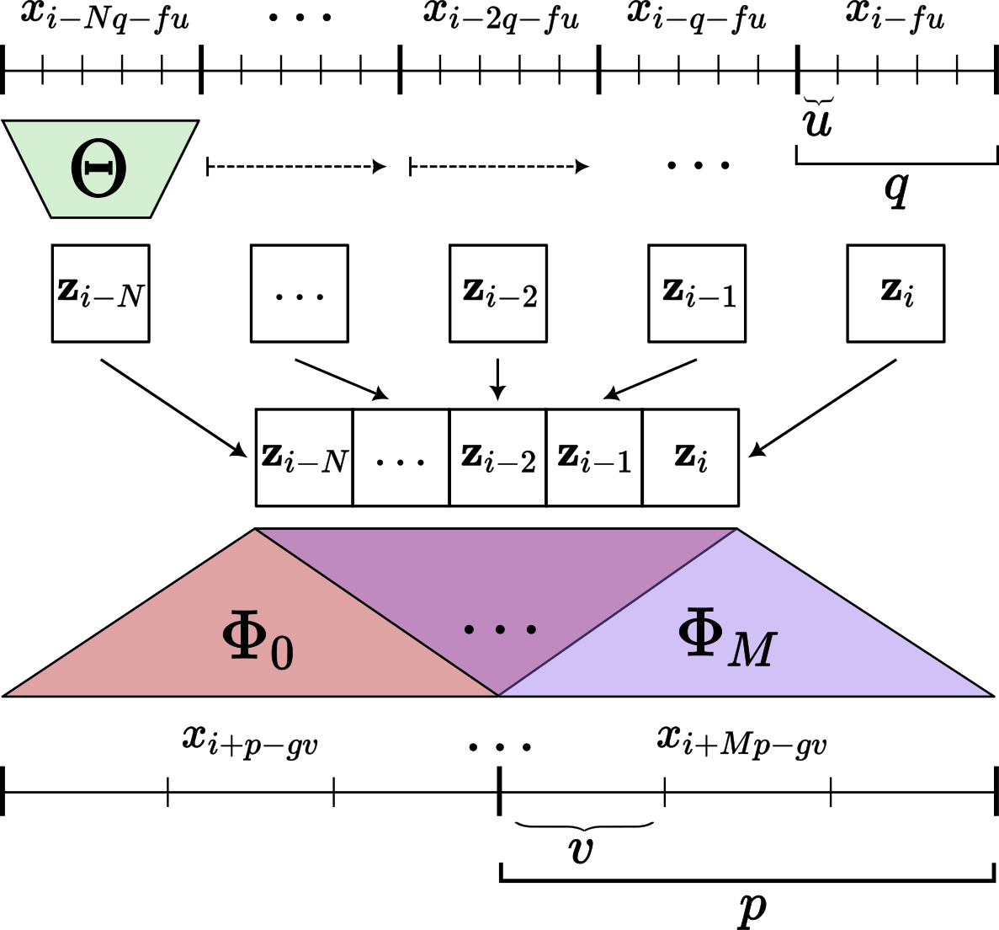
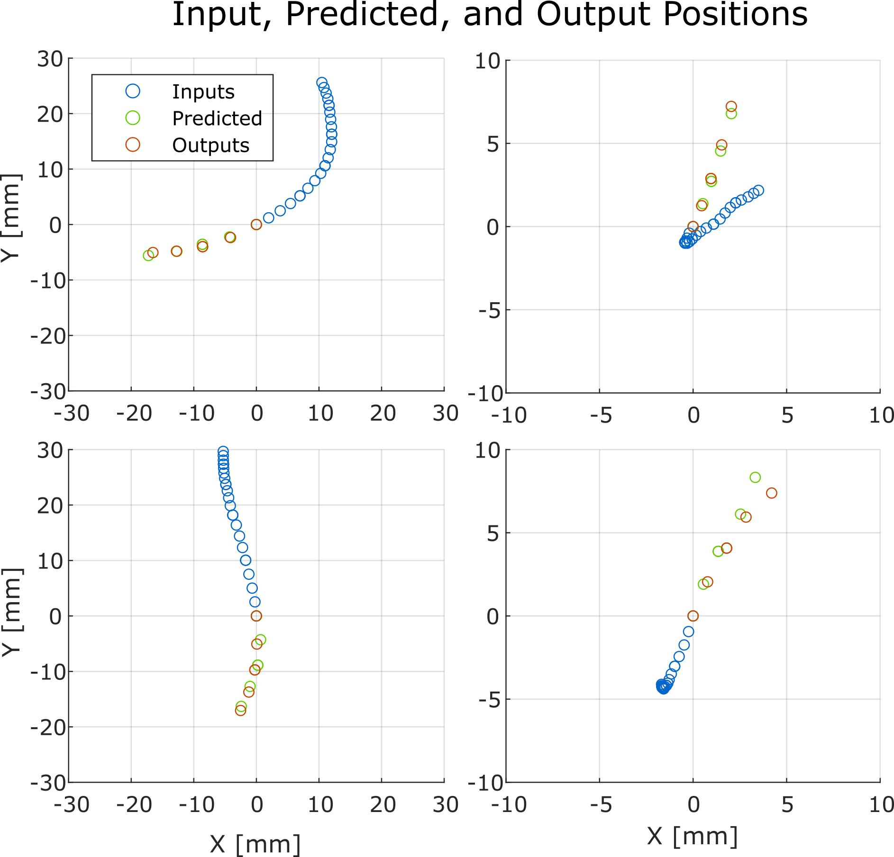
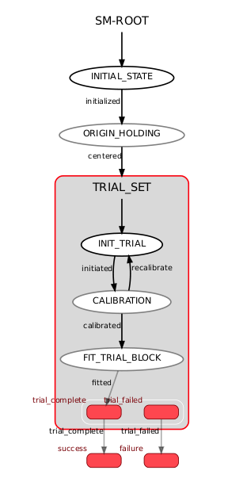

# Variable Impedance Controller with Online Motion Intent Prediction
ROS metapackage repo for implimenting variable impedance control with motion intention prediction experiments. 
It's intented to be used with the iiwa_ros repo and private admittance_control repo.

The current metapackage has the following components:
| Components | Description |
| ---- | --- |
| Motion Intention| ROS Package that handles online motion intention forecasting using Autoregressive Neural Networks |
| Protocol Controller | ROS Package that implements the experiment protocol using state machine library SMACH |

# More about Motion Intention
In general, motion intention estimation is a large field of human-robotics interaction research with many different useful methods that aim to answer the problem of what the human user is trying to do. In this repo, we use a pretrained model taken from our previous work that predicts the most likely future coupled human-robot states given a history of past states trained from a mix of simulated and real recorded human-robot interaction data. For more information on the model architecture and training, see the paper [here](https://doi.org/10.1109/LRA.2023.3306646). 

The motion_intention package impliments a wrapper for this network to make it deployable in an online setting with ROS.

# More about Protocol Controller
The Protocol Controller uses the Python library [SMACH](http://wiki.ros.org/smach), a task-level architecture for rapidly creating complex robot behavior, to implement a state machine with the following states:
- [Initial State](#More-About-Initial-State)
- [Origin Holding](#More-About-Origin-Holding)
- [Trial Set](#More-About-Trial-Set)
  - [Init](#More-About-Init-State)
  - [Calibration](#More-About-Calibration)
  - [Fit Trial Block](#More-About-Fit-Trial-Block)
 

 
# More About Initial State
The Initial State initializes the global variables that are used consistently throughout the experiment. The output keys for the state are Default Stiffness and Damping Parameters, senstitivity constant, shifting constant and tuning parameters. After the variables are successfully initialized, the state exits with the outcome "Intialized" to the next state Origin Holding.

# More About Origin Holding
The Origin Holding helps the robot to move to a pre-defined origin postion defined by the particular joint angles at a stable and safe pace. The state allows us to resort to the origin pose while initiating a trial or when anything goes awry during the experiments. 
# More About Trial Set
The Trial Set is a hierarchical state machine with children states Init, Calibration and Fit Trial Block. It first executes the Init State that initializes trial related variables and prepares for ensuing trial blocks. Subseequently, we calibrate our control parameters to adapt to each user through a set of trials, following which we execute a set of fitting trials using our Motion Intent Network to forecast user intent during trials and other contemporary fitting methods like Linear Fitting and Gradient Weighted Algebraic Fitting to gauge its performance. 

# More About Init State
The Init State is treated as the jumping off point for our trial set. The state initialzes trial variables and overrides pre-defined variables, if required. It keep keeps track of the control parameters (which are optimized for each user) and updates it with the outputs form Calibration State. Once optimization is successfully accomplished, we pass the pertinent values to the fitting trial method. (Trial Set is quite WIP and we may change the protocol in the future to achieve better perfomance and a more user adaptable appraoch).

# More About Calibration
The Calibration State sources its parameters from the Init States and performs a block of trial to optimize these control paramters. The state is very much WIP, and we are exploring various approaches to discern the best fit for our setup. 

# More About Fit Trial Block
The Fit Trial Block executes the core set of trials that uses our Motion Intent Network to forecast user intent, and the controller provides restoring force accordingly to achieve better stability, agility and general performance during physical human robot interactions. Additionally, we use two commonly used fitting algorithms (Circle Fitting using Pratt's Algorithm and Linear Fitting) to evince the utility of a more robust fitting approach proposed. The Fit Trial Block state would ideally take input of the fitting method and accordingly forecast motion intent that particular fitting method. If we encounter any issues or discrepancies during the trials, we exit the state and revert to origin holding which centers the KUKA robot. 
